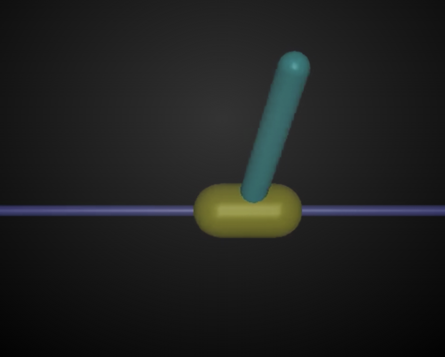

# DDPG


Reimplementing DDPG from Continuous Control with Deep Reinforcement Learning based on OpenAI Gym and Tensorflow

[http://arxiv.org/abs/1509.02971](http://arxiv.org/abs/1509.02971)

There are still some issues to be solved in this implementation. The performance is still bad. I hope anybody who study DDPG could help figure out how to improve the performance.

## How to use

```
git clone https://github.com/songrotek/DDPG.git
cd DDPG
python gym_ddpg.py

```

## Reference
1 [https://github.com/rllab/rllab](https://github.com/rllab/rllab)

2 [https://github.com/MOCR/DDPG](https://github.com/MOCR/DDPG)


